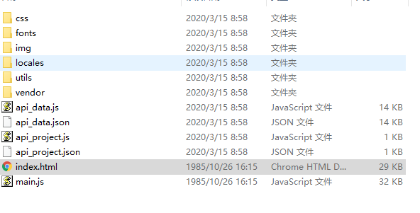
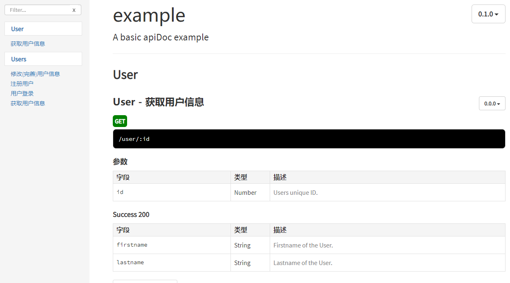

### 前提

先安装 node.js  
通过命令安装
```
npm install apidoc -g
```
windows下 安装之后会报下面错， 忽略就好
```
npm WARN optional SKIPPING OPTIONAL DEPENDENCY: fsevents@2.1.2 (node_modules\apidoc\node_modules\fsevents):
npm WARN notsup SKIPPING OPTIONAL DEPENDENCY: Unsupported platform for fsevents@2.1.2: wanted {"os":"darwin","arch":"any"} (current: {"os":"win32","arch
":"x64"})

```
测试安装上了
```
apidoc -h
```

#### 注释怎么写
@api
```
@api {method} path [title]

method：请求方法，
path：请求路径 
title(可选)：标题
```
@apiDescription
```
@apiDescription text
text说明
```
@apiError
`@apiError [(group)] [{type}] field [description]

（group）（可选）：参数将以这个名称分组，不设置的话，默认是Error 4xx 
{type}（可选）：返回值类型，例如：{Boolean}, {Number}, {String}, {Object}, {String[]} 
field：返回值字段名称 
descriptionoptional（可选）：返回值字段说明`

@apiGroup
```
@apiGroup name
name：组名称，也是导航的标题
```
详见官方文档  https://apidocjs.com/#params

### 例子

#### 构建
新建IDEA，选择web

主目录新建 apidoc.json 文件 与src平级的
内容如下
```
{
  "name": "example",
  "version": "0.1.0",
  "description": "A basic apiDoc example"
}
```
更多配置参考：http://apidocjs.com/#configuration

写注释
```
    /**
     * @api {POST} /register 注册用户
     * @apiGroup Users
     * @apiVersion 0.0.1
     * @apiDescription 用于注册用户
     * @apiParam {String} account 用户账户名
     * @apiParam {String} password 密码
     * @apiParam {String} mobile 手机号
     * @apiParam {int} vip = 0  是否注册Vip身份 0 普通用户 1 Vip用户
     * @apiParam {String} [recommend] 邀请码
     * @apiParamExample {json} 请求样例：
     *                ?account=sodlinken&password=11223344&mobile=13739554137&vip=0&recommend=
     * @apiSuccess (200) {String} msg 信息
     * @apiSuccess (200) {int} code 0 代表无错误 1代表有错误
     * @apiSuccessExample {json} 返回样例:
     *                {"code":"0","msg":"注册成功"}
     */
```

先cd到工程的外层目录，并在外层目建个输出文档的目录，我建的是docapi。
输命令
```
apidoc -i springboot-apidoc/ -o docapi/
```
-i 输入目录 -o 输出目录
生成文件



打开 index.html




