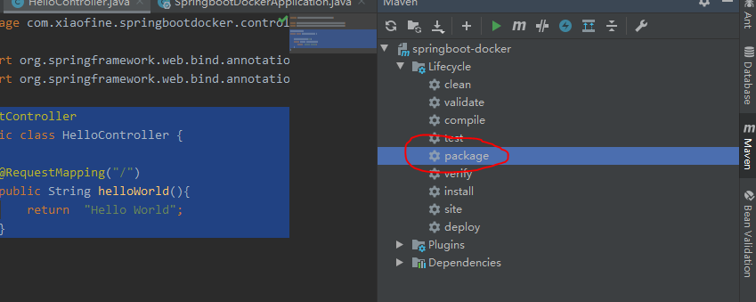
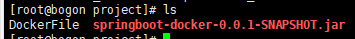
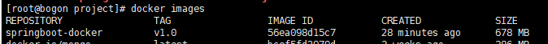
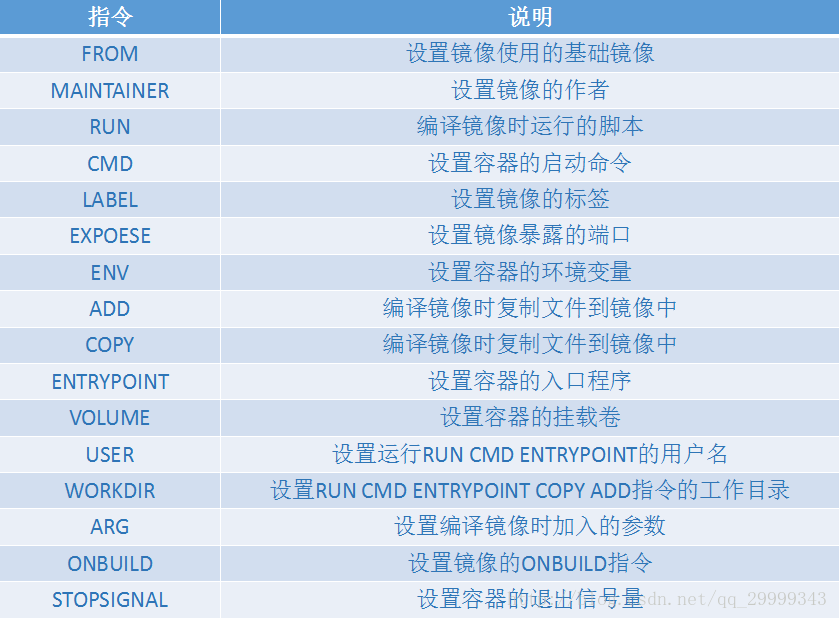

### 简介
为 springboot程序构建一个docker镜像。docker 是一个开源的应用容器引擎，基于 Go 语言 并遵从Apache2.0协议开源。Docker 可以让开发者打包他们的应用以及依赖包到一个轻量级、可移植的容器中，然后发布到任何流行的 Linux 机器上，也可以实现虚拟化。容器是完全使用沙箱机制，相互之间不会有任何接口（类似 iPhone 的 app）,更重要的是容器性能开销极低。

##### 构建
Packaging 选择 jar
依赖选择web

随便添加一个controller
如
```
@RestController
public class HelloController {

    @RequestMapping("/")
    public String helloWorld(){
        return  "Hello World";
    }
}
```
#### 使用maven打包项目成jar包
##### 1.可以直接在界面操作



控制台打印的log里有jar包生成的位置

##### 2.使用命令打包
在项目跟目录下 执行下面命令也是一样的效果
```
mvn clean package
```

##### 创建Dockerfile文件
**注意文件没有后缀**（官网说明 
https://docs.docker.com/engine/reference/builder/）
```
# Pull base image
FROM  java:8

VOLUME /tmp

# 添加
ADD springboot-docker-0.0.1-SNAPSHOT.jar app.jar
RUN bash -c 'touch /app.jar'


# Define default command.
ENTRYPOINT ["java","-Djava.security.egd=file:/dev/./urandom","-jar","/app.jar"]

#设置时区
RUN /bin/cp /usr/share/zoneinfo/Asia/Shanghai /etc/localtime && echo 'Asia/Shanghai' >/etc/timezone
```

将dockerfile文件和生成好的jar 使用ftp工具上传到linux服务器 随便找个文件夹 放进去 jar和dockerfile在同级目录下



##### linux下
当前目录下执行
```
docker build -f DockerFile -t springboot-docker:v1.0 .
```
如果 Dockerfile 文件名为 “Dockerfile”可以用下面命令
```
docker build -t springboot-docker:v1.0 .
```
-f 表示 dockerfile 文件的文件路径
最后面的这个 . 代表在当前目录下面寻找 dockerfile 文件
springboot-docker   指镜像名字
v1.0 指版本

然后使用 docker images 查看生成的镜像



启动镜像
```
docker run -d -p 8080:8080 springboot-docker:v1.0
```
##### 测试
打开对应地址，成功


##### 官方文档
https://docs.docker.com/engine/reference/builder/

##### 安装docker参考
https://www.runoob.com/docker/docker-tutorial.html

##### dockerfile 命令的说明




##### 最后说明：
因为我windows平台 Docker Desktop，和docker toolbox  都安装失败。所以使用linux虚拟机方式 来使用docker


官方推荐WIN10 64位用户使用 Docker Desktop，但是这个不能选择安装位置，会占用C盘空间。


