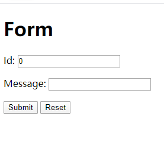
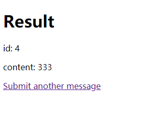

#### 构建
IDEA新建项目选择 Web Thymeleaf

或者添加POM依赖
```
<dependency>
	<groupId>org.springframework.boot</groupId>
	<artifactId>spring-boot-starter-thymeleaf</artifactId>
</dependency>
<dependency>
	<groupId>org.springframework.boot</groupId>
	<artifactId>spring-boot-starter-web</artifactId>
</dependency>
```
#### 编码
##### 创建实体类
```
public class Greeting {

    private long id;
    private String content;

    public long getId() {
        return id;
    }

    public void setId(long id) {
        this.id = id;
    }

    public String getContent() {
        return content;
    }

    public void setContent(String content) {
        this.content = content;
    }

}
```

##### 创建Controller
```
@Controller
public class GreetingController {

    @GetMapping("/greeting")
    public String greetingForm(Model model) {
        model.addAttribute("greeting", new Greeting());
        return "greeting";
    }

    @PostMapping("/greeting")
    public String greetingSubmit(@ModelAttribute Greeting greeting) {
        return "result";
    }

}
```

##### 页面展示层
src/main/resources/templates/greeting.html
```
<!DOCTYPE HTML>
<html xmlns:th="https://www.thymeleaf.org">
<head>
    <title>Getting Started: Handling Form Submission</title>
    <meta http-equiv="Content-Type" content="text/html; charset=UTF-8" />
</head>
<body>
<h1>Form</h1>
<form action="#" th:action="@{/greeting}" th:object="${greeting}" method="post">
    <p>Id: <input type="text" th:field="*{id}" /></p>
    <p>Message: <input type="text" th:field="*{content}" /></p>
    <p><input type="submit" value="Submit" /> <input type="reset" value="Reset" /></p>
</form>
</body>
</html>
```
结果页面
src/main/resources/templates/result.html
```
<!DOCTYPE HTML>
<html xmlns:th="https://www.thymeleaf.org">
<head>
    <title>Getting Started: Handling Form Submission</title>
    <meta http-equiv="Content-Type" content="text/html; charset=UTF-8" />
</head>
<body>
<h1>Result</h1>
<p th:text="'id: ' + ${greeting.id}" />
<p th:text="'content: ' + ${greeting.content}" />
<a href="/greeting">Submit another message</a>
</body>
</html>
```

#### 测试
启动工程，访问
http://localhost:8080/greeting



提交结果



#### 官网地址
https://spring.io/guides/gs/handling-form-submission/