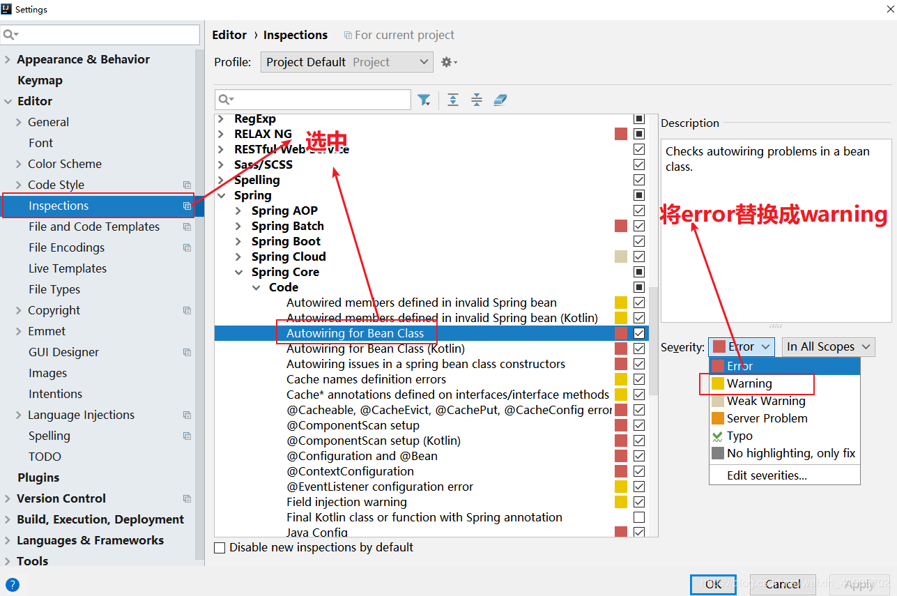

### 构建
IDEA新建项目是选择 web  Mybatis MYSQL

或者直接maven添加依赖
```
<dependency>
	<groupId>org.mybatis.spring.boot</groupId>
	<artifactId>mybatis-spring-boot-starter</artifactId>
	<version>2.1.2</version>
</dependency>

<dependency>
	<groupId>mysql</groupId>
	<artifactId>mysql-connector-java</artifactId>
	<scope>runtime</scope>
</dependency>
```


最后添加druid 连接池
```
<dependency>    
    <groupId>com.alibaba</groupId>    
    <artifactId>druid </artifactId>    
    <version>1.1.21</version>
</dependency>
```

#### 配置文件
application.yml
```
spring:
  datasource:
    username: root
    password: 123456
    url: jdbc:mysql://192.168.1.107:3306/entity?serverTimezone=GMT%2B8&useSSL=false
    driver-class-name: com.mysql.cj.jdbc.Driver
    type: com.alibaba.druid.pool.DruidDataSource
```
通过注解形式实现

#### 编码
模型实体类
```
public class User {

    private int id;

    private String name ;

    private String email;

    省略 setter getter toString
}
```


dao层
```
@Mapper
public interface UserMapper {

    @Insert("insert into user(name,email) values(#{name},#{email})")
    int add(@Param("name") String name,@Param("email") String email);
    @Update("update user set name = #{name},email =#{email} where id=#{id} ")
    int update(@Param("name") String name, @Param("email") String email,@Param("id") int id);
    @Delete("delete from user where id =  #{id}")
    int delete(@Param("id") int id);
    @Select("select id,name,email from user where id =#{id}")
    User findUser(@Param("id") int id);
    @Select("select id,name,email from user")
    List<User> findUserList();

}
```

server层
```
@Service
public class UserService {

    @Autowired(required = false)
    private UserMapper userMapper;

    public int add(String name,String email) {
        return userMapper.add(name,email);
    }

    public int update(String name,String email,int id) {
        return userMapper.update(name,email,id);
    }

    public int delete(int id) {
        return userMapper.delete(id);
    }

    public User findUserById(int id) {
        return userMapper.findUser(id);
    }

    public List<User> findAllUsers() {
        return userMapper.findUserList();
    }
}
```

controller层
```
@RestController
@RequestMapping("/user")
public class UserController {

    @Autowired
    UserService userService;

    @RequestMapping(value = "",method = RequestMethod.POST)
    public String addUser(@RequestParam(value = "name")String name,
                          @RequestParam(value = "email")String email){
        int t = userService.add(name, email);
        if(t==1){
            return "success";
        }else {
            return "fail";
        }
    }

    @RequestMapping(value="/{id}",method = RequestMethod.PUT)
    public String updateUser(@PathVariable("id") int id ,
                             @RequestParam(value = "name",required = true)String name,
                             @RequestParam(value = "email",required = true) String email){

        int t = userService.update(name, email, id);
        if(t==1){
            return "success";
        }else {
            return "fail";
        }
    }

    //默认不写是GET请求
    @RequestMapping("delete/{id}")
    public String deleteUser(@PathVariable("id") int id){
        int t = userService.delete(id);
        if(t==1){
            return "succese delete"+id;
        }else {
            return "fail";
        }
    }


    @RequestMapping(value = "/{id}",method = RequestMethod.GET)
    public User getUserById(@PathVariable("id") int id){
        return userService.findUserById(id);
    }

    @RequestMapping(value="list",method = RequestMethod.GET)
    public List<User> getUsers(){
        return userService.findAllUsers();
    }
}
```
#### 测试
使用postman 或者IDEA自带的 IDEA REST Client


##### 问题1
service使用mapper时IDEA会报错

方法1： 增加 required = false
@Autowired(required = false)
private UserMapper userMapper;

方法2： 修改IDEA的提醒等级




