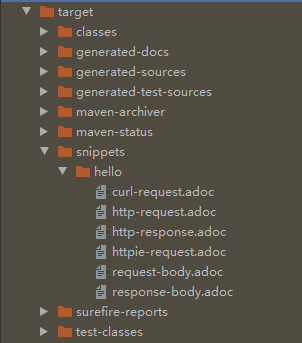
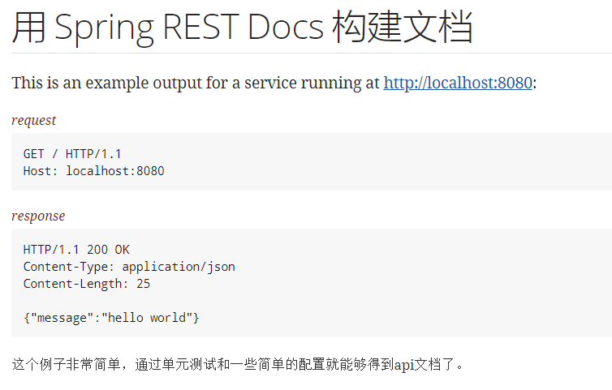

### 简介
用spring官方推荐的restdoc去生成api文档。本文创建一个简单的springboot工程，将http接口通过Api文档暴露出来。只需要通过 JUnit单元测试和Spring的MockMVC就可以生成文档。

### 构建
IDEA 新建项目选择 Web   Spring REST Docs
或者直接引入依赖 POM
```
<dependency>
	<groupId>org.springframework.restdocs</groupId>
	<artifactId>spring-restdocs-mockmvc</artifactId>
	<scope>test</scope>
</dependency>
```
#### 编码
随便写一个controller
```
@RestController
public class HelloController {

    @RequestMapping("/")
    public Map<String, Object> HelloWorld(){
        return Collections.singletonMap("message","hello world");
    }
}
```
**Restdoc,通过单元测试生成api文档**
restdocs是通过单元测试生存snippets文件，然后snippets根据插件生成htm文档的。

#### 建单元测试类
```
@RunWith(SpringRunner.class)
@WebMvcTest(HelloController.class)
@AutoConfigureRestDocs(outputDir = "target/snippets")
public class WebLayerTest {

    @Autowired
    private MockMvc mockMvc;

    @Test
    public void shouldReturnDefaultMessage() throws Exception{
        this.mockMvc.perform(get("/")).andDo(print()).andExpect(status().isOk())
                .andExpect(content().string(containsString("hello world")))
                .andDo(document("hello"));
    }
}
```

其中，@ AutoConfigureRestDocs注解开启了生成snippets文件，并指定了存放位置。

启动单元测试，测试通过，你会发现在target文件下生成了一个snippets文件夹，其目录结构如下：



默认情况下，snippets是Asciidoctor格式的文件，包括request和reponse，另外其他两种httpie和curl两种流行的命令行的http请求模式。
到目前为止，只生成了Snippets文件，需要用Snippets文件生成文档。
怎么用Snippets创建一个新文件src/main/asciidoc/index.adoc ：

```
= 用 Spring REST Docs 构建文档

This is an example output for a service running at http://localhost:8080:

.request
include::{snippets}/hello/http-request.adoc[]

.response
include::{snippets}/hello/http-response.adoc[]

这个例子非常简单，通过单元测试和一些简单的配置就能够得到api文档了。
```
adoc的书写格式，参考:http://docs.spring.io/spring-restdocs/docs/current/reference/html5/，这里不多讲解。

#### 配置插件
需要使用asciidoctor-maven-plugin插件，在其pom文件加上：
```
<plugin>
	<groupId>org.asciidoctor</groupId>
	<artifactId>asciidoctor-maven-plugin</artifactId>
	<executions>
		<execution>
			<id>generate-docs</id>
			<phase>prepare-package</phase>
			<goals>
				<goal>process-asciidoc</goal>
			</goals>
			<configuration>
				<sourceDocumentName>index.adoc</sourceDocumentName>
				<backend>html</backend>
				<attributes>
					<snippets>${project.build.directory}/snippets</snippets>
				</attributes>
			</configuration>
		</execution>
	</executions>
</plugin>
```

这时只需要通过mvnw package命令就可以生成文档了。 在/target/generated-docs下有个index.html，打开这个html,显示如下，界面还算简洁：




通过单元测试，生存adoc文件，再用adoc文件生存html，只需要简单的几步就可以生成一个api文档的html文件，这个html文件你可以通网站发布出去。整个过程很简单，对代码无任何影响。


##### 问题1
测试时 导入测试get等静态方法 或者参考源码
```
import static org.hamcrest.CoreMatchers.containsString;
import static org.springframework.restdocs.mockmvc.MockMvcRestDocumentation.document;
import static org.springframework.test.web.servlet.request.MockMvcRequestBuilders.get;
import static org.springframework.test.web.servlet.result.MockMvcResultHandlers.print;
import static org.springframework.test.web.servlet.result.MockMvcResultMatchers.content;
import static org.springframework.test.web.servlet.result.MockMvcResultMatchers.status;

```


##### 问题2
执行 mvnw package 时 如果报错 JAVA_HOME找不到 可以使用 管理员模式打开控制台再试