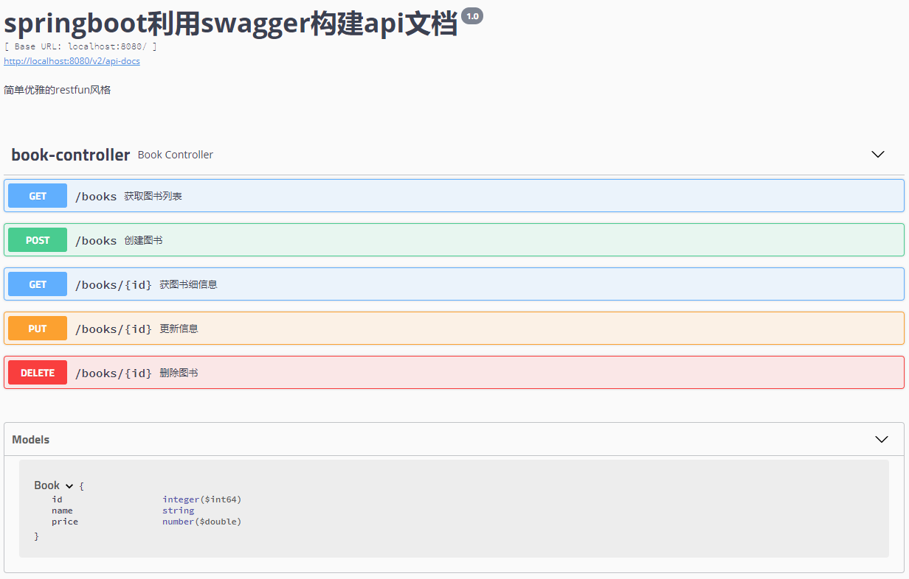
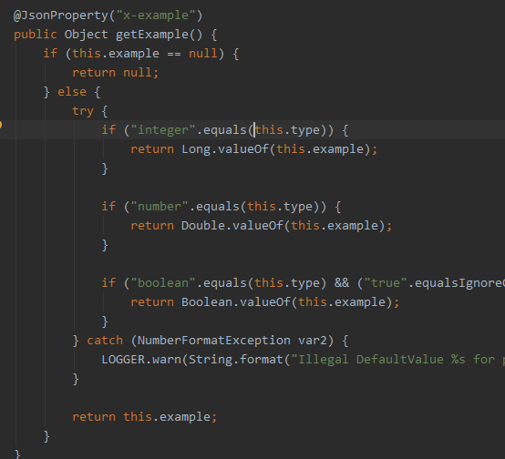
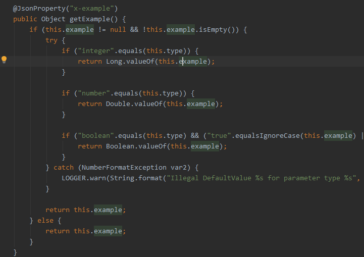

### 简介
swagger,中文“拽”的意思。它是一个功能强大的api框架，它的集成非常简单，不仅提供了在线文档的查阅，而且还提供了在线文档的测试。另外swagger很容易构建restful风格的api，简单优雅帅气，正如它的名字。

### 构建

### 引入依赖
```
<!-- https://mvnrepository.com/artifact/io.springfox/springfox-swagger2 -->
<dependency>
	<groupId>io.springfox</groupId>
	<artifactId>springfox-swagger2</artifactId>
	<version>2.9.2</version>
</dependency>
<!-- https://mvnrepository.com/artifact/io.springfox/springfox-swagger-ui -->
<dependency>
	<groupId>io.springfox</groupId>
	<artifactId>springfox-swagger-ui</artifactId>
	<version>2.9.2</version>
</dependency>
```

#### 编码
写配置类
```
@Configuration
@EnableSwagger2
public class Swagger2 {
    
    @Bean
    public Docket createRestApi() {
        return new Docket(DocumentationType.SWAGGER_2)
                .apiInfo(apiInfo())
                .select()
                .apis(RequestHandlerSelectors.basePackage("com.xiaofine.speingbootswagger.controller"))
                .paths(PathSelectors.any())
                .build();
    }
    private ApiInfo apiInfo() {
        return new ApiInfoBuilder()
                .title("springboot利用swagger构建api文档")
                .description("简单优雅的restfun风格")
                .termsOfServiceUrl("")
                .version("1.0")
                .build();
    }
}
```

通过@Configuration注解，表明它是一个配置类，@EnableSwagger2开启swagger2。apiINfo()配置一些基本的信息。apis()指定扫描的包会生成文档。

#### 写生产文档的注解
swagger通过注解表明该接口会生成文档，包括接口名、请求方法、参数、返回信息的等等。

* @Api：修饰整个类，描述Controller的作用
* @ApiOperation：描述一个类的一个方法，或者说一个接口
* @ApiParam：单个参数描述
* @ApiModel：用对象来接收参数
* @ApiProperty：用对象接收参数时，描述对象的一个字段
* @ApiResponse：HTTP响应其中1个描述
* @ApiResponses：HTTP响应整体描述
* @ApiIgnore：使用该注解忽略这个API
* @ApiError ：发生错误返回的信息
* @ApiParamImplicitL：一个请求参数
* @ApiParamsImplicit 多个请求参数

例子
```
@RestController
@RequestMapping(value = "/books")
public class BookController {

    Map<Long, Book> books = Collections.synchronizedMap(new HashMap<Long, Book>());

    @ApiOperation(value="获取图书列表", notes="获取图书列表")
    @RequestMapping(value={""}, method= RequestMethod.GET)
    public List<Book> getBook() {
        List<Book> book = new ArrayList<>(books.values());
        return book;
    }

    @ApiOperation(value="创建图书", notes="创建图书")
    @ApiImplicitParam(name = "book", value = "图书详细实体", required = true, dataType = "Book")
    @RequestMapping(value="", method=RequestMethod.POST)
    public String postBook(@RequestBody Book book) {
        books.put(book.getId(), book);
        return "success";
    }
    @ApiOperation(value="获图书细信息", notes="根据url的id来获取详细信息")
    @ApiImplicitParam(name = "id", value = "ID", required = true, dataType = "Long",paramType = "path")
    @RequestMapping(value="/{id}", method=RequestMethod.GET)
    public Book getBook(@PathVariable Long id) {
        return books.get(id);
    }

    @ApiOperation(value="更新信息", notes="根据url的id来指定更新图书信息")
    @ApiImplicitParams({
            @ApiImplicitParam(name = "id", value = "图书ID", required = true, dataType = "Long",paramType = "path"),
            @ApiImplicitParam(name = "book", value = "图书实体book", required = true, dataType = "Book")
    })
    @RequestMapping(value="/{id}", method= RequestMethod.PUT)
    public String putUser(@PathVariable Long id, @RequestBody Book book) {
        Book book1 = books.get(id);
        book1.setName(book.getName());
        book1.setPrice(book.getPrice());
        books.put(id, book1);
        return "success";
    }
    @ApiOperation(value="删除图书", notes="根据url的id来指定删除图书")
    @ApiImplicitParam(name = "id", value = "图书ID", required = true, dataType = "Long",paramType = "path")
    @RequestMapping(value="/{id}", method=RequestMethod.DELETE)
    public String deleteUser(@PathVariable Long id) {
        books.remove(id);
        return "success";
    }

    @ApiIgnore//使用该注解忽略这个API
    @RequestMapping(value = "/hi", method = RequestMethod.GET)
    public String  jsonTest() {
        return " hi you!";
    }
}
```

通过相关注解，就可以让swagger2生成相应的文档。如果你不需要某接口生成文档，只需要在加@ApiIgnore注解即可。需要说明的是，如果请求参数在url上，@ApiImplicitParam 上加paramType = “path” 。

#### 测试

启动工程，访问：http://localhost:8080/swagger-ui.html ，就看到swagger-ui:


整个集成过程非常简单，但是我看了相关的资料，swagger没有做安全方面的防护，可能需要我们自己做相关的工作。


##### 问题1：
访问首页时控制台会报错 
说是因为
@ApiModelProperty的问题
但是我没用这个注释
最后增加POM依赖解决
```
<dependency>
	<groupId>io.swagger</groupId>
	<artifactId>swagger-annotations</artifactId>
	<version>1.5.22</version>
</dependency>
<dependency>
	<groupId>io.swagger</groupId>
	<artifactId>swagger-models</artifactId>
	<version>1.5.22</version>
</dependency>
```
错误位置
swagger-models-1.5.20.jar!\io\swagger\models\parameters\AbstractSerializableParameter.class


在1.5.22中解决了
swagger-models-1.5.22.jar!\io\swagger\models\parameters\AbstractSerializableParameter.class

