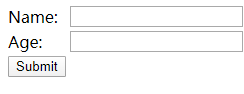
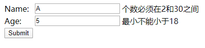
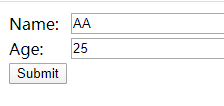
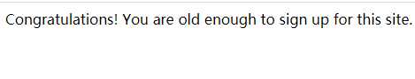

### 简介
在springboot中验证表单信息。在springmvc工程中，需要检查表单信息，表单信息验证主要通过注解的形式。

#### 构建

IDEA新建 选择  Web  Thymeleaf

或者引入POM依赖
```
<dependency>
	<groupId>org.springframework.boot</groupId>
	<artifactId>spring-boot-starter-thymeleaf</artifactId>
</dependency>
<dependency>
	<groupId>org.springframework.boot</groupId>
	<artifactId>spring-boot-starter-web</artifactId>
</dependency>
```
#### 编码
##### 创建一个PresonForm的Object类
```
import javax.validation.constraints.Min;
import javax.validation.constraints.NotNull;
import javax.validation.constraints.Size;

public class PersonForm {

    @NotNull
    @Size(min=2, max=30)
    private String name;

    @NotNull
    @Min(18)
    private Integer age;

    public String getName() {
        return this.name;
    }

    public void setName(String name) {
        this.name = name;
    }

    public Integer getAge() {
        return age;
    }

    public void setAge(Integer age) {
        this.age = age;
    }

    public String toString() {
        return "Person(Name: " + this.name + ", Age: " + this.age + ")";
    }
}
```
这个实体类，在2个属性:name,age.它们各自有验证的注解：
* @Size(min=2, max=30) name的长度为2-30个字符
* @NotNull 不为空
* @Min(18)age不能小于18


##### 创建 web Controller
```
@Controller
public class WebController implements WebMvcConfigurer {

    @Override
    public void addViewControllers(ViewControllerRegistry registry) {
        registry.addViewController("/results").setViewName("results");
    }

    @GetMapping("/")
    public String showForm(PersonForm personForm) {
        return "form";
    }

    @PostMapping("/")
    public String checkPersonInfo(@Valid PersonForm personForm, BindingResult bindingResult) {

        if (bindingResult.hasErrors()) {
            return "form";
        }

        return "redirect:/results";
    }
}
```
##### 创建form表单
```
<html>
<body>
<form action="#" th:action="@{/}" th:object="${personForm}" method="post">
    <table>
        <tr>
            <td>Name:</td>
            <td><input type="text" th:field="*{name}" /></td>
            <td th:if="${#fields.hasErrors('name')}" th:errors="*{name}">Name Error</td>
        </tr>
        <tr>
            <td>Age:</td>
            <td><input type="text" th:field="*{age}" /></td>
            <td th:if="${#fields.hasErrors('age')}" th:errors="*{age}">Age Error</td>
        </tr>
        <tr>
            <td><button type="submit">Submit</button></td>
        </tr>
    </table>
</form>
</body>
</html>
```
##### 注册成功的页面
```
<html>
<body>
Congratulations! You are old enough to sign up for this site.
</body>
</html>
```
##### 测试
启动工程，访问http://localhost:8080/：



输入错误信息的



这样输入



成功



#### 官网地址
https://spring.io/guides/gs/validating-form-input/